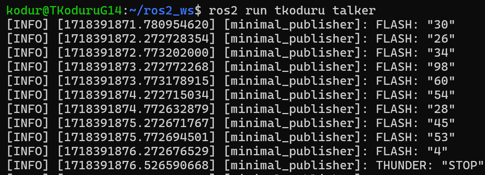
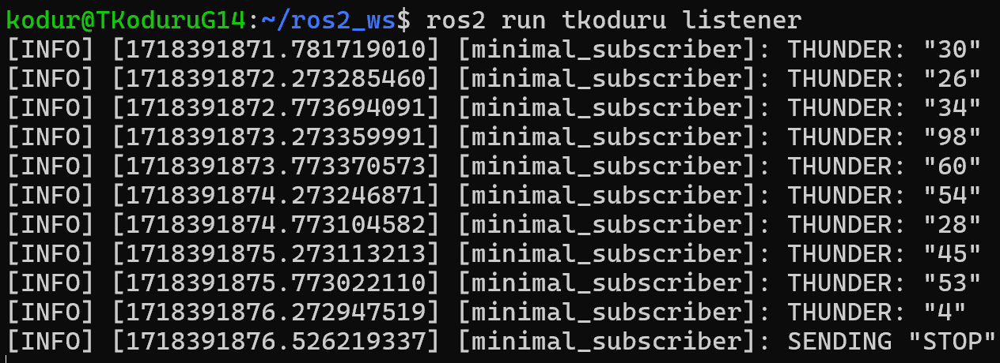
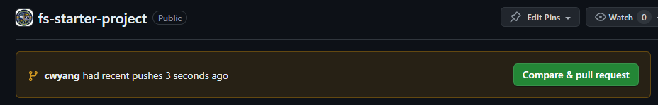
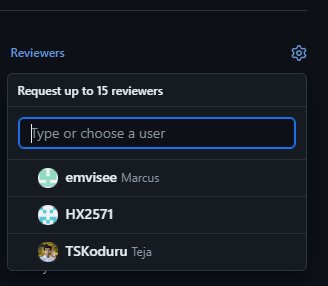

# Flight Systems Starter Project

Hello prospective members :) Follow along this readme to learn about ROS installation, coding your first publisher/subscriber nodes, and git version control. 

ALSO PLEASE MESSAGE ME IF YOU RUN INTO ANY ISSUES OR HAVE SUGGESTIONS xx

## Installing ROS

Go to this link to and follow the instructions to install ROS Humble:
https://docs.ros.org/en/humble/Installation.html

Make sure you have Ubuntu 22 NOT 24!!

_Note: Please use Linux. Windows doesn't support using dependencies in ROS. Also, I can help you if you run into any issues, since I use WSL (which EECS classes also recommend if you have a Windows computer)._

_Note #2: Make sure every ROS documentation tutorial you follow is for ROS HUMBLE. The newest version, Jazzy, is incompatible with our flight computer, the Jetson Nano._

Next, configure your environment: https://docs.ros.org/en/humble/Tutorials/Beginner-CLI-Tools/Configuring-ROS2-Environment.html

To complete setup, install colcon:

- Linux: `sudo apt install python3-colcon-common-extensions`
- macOS: `python3 -m pip install colcon-common-extensions`

## Setting up your workspace

Once you've sourced ROS, you can create a new directory. This will house all of your flight systems code for the year.

`mkdir -p ~/ros2_ws/src`

`cd ~/ros2_ws/src`

Next, clone this repository. (If you don't have git, go on a side quest and install that. https://git-scm.com/book/en/v2/Getting-Started-Installing-Git)

`git clone https://github.com/mfly-auton-software/fs-starter-project.git`

`cd fs-starter-project`

Change to a new branch and name it your uniqname: `git checkout -b <your-uniqname>`

## Create a package

A package is an organizational unit for your ROS 2 code. If you want to be able to install your code or share it with others, then you’ll need it organized in a package. With packages, you can release your ROS 2 work and allow others to build and use it easily.

Package creation in ROS 2 uses ament as its build system and colcon as its build tool. We will be using Python to create all of our packages.

Make sure that you are in the correct folder (the repository folder under the workspace src folder). Then, run the following command, which creates a new package named your uniqname:

`ros2 pkg create --build-type ament_python --license Apache-2.0 <your-uniqname>`

## Basic publisher/subscriber

To write your first publisher/subscriber node, follow this tutorial (make sure you're in the Python tab): https://docs.ros.org/en/humble/Tutorials/Beginner-Client-Libraries/Writing-A-Simple-Py-Publisher-And-Subscriber.html

*Note: You can skip the first step, "Create a package", as you've already done that.* 

*Note #2: They named the package "py_pubsub" so just use common sense and replace that with your uniqname wherever they use it :)*

## Advanced publisher/subscriber

This part is for those of you who feel confident enough in your coding skills to do something a little more complicated. The idea is to take the basic ROS template from above and do the following:

1. Figure out a way to have two-way communcation between nodes. i.e, instead of having a node be either a publisher or a subscriber, have it be both.

2. After you figure out how to do that, we're gonna have a little more fun with our communication. This time, make one of the nodes transmit a random number continuously. The other node should receive this number and print it to the terminal, but after it receives a total of ten messages, it should send a 'STOP' signal to the first node. Once the first node receives this signal, it should stop transmitting numbers. Print out a messgae to the terminal to let the user know that the communication has ended.

3. If you have any other ideas that you want to play around with, go crazy. This is your time to experiment and learn.

Here's an example of what the output should look like (I coded this example so that FLASH corresponds to the transmitter, and THUNDER to the receiver):

Note how the transmitter stops transmitting numbers after the receiver sends the 'STOP' signal. Anyways, have fun making this!

FYI, I (Teja) convinced Cindy to add this part in, so if you're feeling like you want to bash your head against a wall, you can blame me. Good luck, though!

## Turn in your project!

Take a screenshot of your code running in the terminals successfully and send it to me (Cindy) over slack. Or show me irl. 

Next, create a pull request for your code by pushing to your new branch:

`git add .`

`git commit -m "commit message"`

`git push --set-upstream origin <your-uniqname>`

If you get a permissions error, ask me for access to the repo. ty

Navigate to the repository, where you should see a big ol' "Compare & pull request" button. Click it.

Add a title and description. In your description, include the following information:

- Name, grade, major
- What you hope to work on in MFly
- Favorite artist or book or movie (and why). No this definitely isn't me looking for free recommendations
- whatever else you want. it's your PR bro

Click "Create pull request". Then, go to the top right (ish) of the screen and click "Reviewers", then search for my username (elemelonwind). Add me as a reviewer. Also ping me on slack because I don't trust GitHub notifs

If you pass all the vibe checks, I will approve your code and merge it. Congratulations and welcome to flight systems :D

Credits to Teja our esteemed systems director for making this
